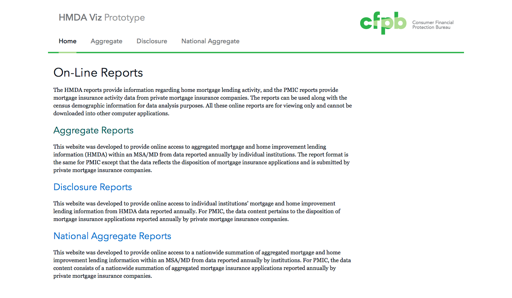

# Hmda Viz Prototype

This is a **prototype** for HMDA aggregate and disclosure reports.

This project has 2 parts:
1. the front-end for the reports, including the process of navigating the forms to generate the tables,
2. along with the processing of the data to generate the json files.



## Dependencies

### Front-end

- Ruby - for installing Jekyll
- [Jekyll](jekyllrb.com/)
- Node - for managing front-end dependencies
- Bower
- Grunt
- [Capital Framework](http://cfpb.github.io/capital-framework/)

### Processing
 - Python
 - PostgreSQL
 - TBD

## Front-end Installation

We use [homebrew](http://brew.sh/) on Mac OSX to manage installation of software. To install the project dependencies using homebrew, navigate to this project's root directory and enter the following:

```shell
$ brew install ruby
$ brew install node
$ gem install jekyll
$ npm install
```

After installation you'll need to build Capital Framework by running:
```shell
$ grunt
```

To launch the site, enter:

```shell
$ jekyll serve
```

The site should now be live at `http://localhost:4000/capital-framework/`.

## Configuration

If the software is configurable, describe it in detail, either here or in other documentation to which you link.

## Usage

Currently only one "path" works in the forms. You have to chose the "Aggregate" report type. Then you have to select:

- "2013" and "Alabama" in the first form and click "Submit" then,
- "11500 - Anniston-Oxford" and click "Select MSA/MD" then,
- "3-1 - Loans Sold by Tract" and click "Select Table".

You should now see an HTML table with options to download the json, csv and print.

## Known issues

We are still in the prototyping phase so there is a lot of work happening on both the front-end and processing sides. One obvious issue is that only one "path" currently works for the forms.

## Getting help

If you have questions, concerns, bug reports, etc, please file an issue in this repository's [Issue Tracker](https://github.com/cfpb/hmda-viz-prototype/issues).

## Getting involved

TBD

----

## Open source licensing info
1. [TERMS](TERMS.md)
2. [LICENSE](LICENSE)
3. [CFPB Source Code Policy](https://github.com/cfpb/source-code-policy/)


----

## Credits and references

1. [FFIEC](http://www.ffiec.gov/HmdaAdWebReport/AggWelcome.aspx)
2. [Federal Register] (http://www.gpo.gov/fdsys/pkg/FR-2004-12-20/pdf/04-27425.pdf)
