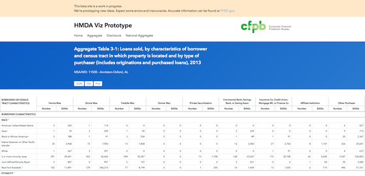

# Hmda Viz Prototype

This is a **prototype** for HMDA aggregate and disclosure reports. It is based on the current [FFIEC On-Line Reports](http://www.ffiec.gov/hmda/online_rpts.htm).

Our working prototype can be found running in [gh-pages](http://cfpb.github.io/hmda-viz-prototype/).

This project has 2 parts:
1. the front-end for the reports, including the process of navigating the forms to generate the tables,
2. along with the processing of the data to generate the json files.


## Dependencies

### Front-end

- Ruby - for installing Jekyll
- [Jekyll](http://jekyllrb.com/docs/installation/)

### Processing
 - Python
 - PostgreSQL
 - TBD

## Front-end Installation

To launch the site, enter:

```shell
$ jekyll serve
```

The site should now be live at `http://127.0.0.1:4000/hmda-viz-prototype/`.

We're using [Jekyll's built-in support](http://jekyllrb.com/docs/assets/) for Sass.

## Configuration

### Front-end

See [Jekyll's configuration documentation](http://jekyllrb.com/docs/configuration/) and the [_config.yml](_config.yml) in this repo.

## Usage

Currently only the 2013/alabama path works in the UI. You can then select any MSA/MD and then choose a report. Reports 3-x and 4-x are working.

You should now see an HTML table with options to download the json, csv and print.



## Known issues

We are still in the prototyping phase so there is a lot of work happening on both the front-end and processing sides. One obvious issue is that only certain paths currently work for the forms.

## Getting help

If you have questions, concerns, bug reports, etc, please file an issue in this repository's [Issue Tracker](https://github.com/cfpb/hmda-viz-prototype/issues).

## Getting involved

TBD

----

## Open source licensing info
1. [TERMS](TERMS.md)
2. [LICENSE](LICENSE)
3. [CFPB Source Code Policy](https://github.com/cfpb/source-code-policy/)


----

## Credits and references

1. [FFIEC](http://www.ffiec.gov/HmdaAdWebReport/AggWelcome.aspx)
2. [Federal Register] (http://www.gpo.gov/fdsys/pkg/FR-2004-12-20/pdf/04-27425.pdf)
3. <http://cfpb.github.io/hmda-viz-prototype/aggregate/2013>


## Status
**Time to Market**  
1. Processing time  
2. Time needed to test format, accuracy, footnotes, etc: 30 hours  
3. Remaining testing items can be found at (https://drive.google.com/open?id=1g6kkDiD4sxoUd10kmYNsmhTsWRL7iWHbf9GjY9B-FMY&authuser=0)


**Files**
Requirements and analysis are saved at (https://drive.google.com/open?id=0B667BGHwjTznb3F0ZmZabUFoc3M&authuser=0)
